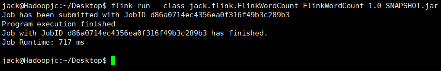
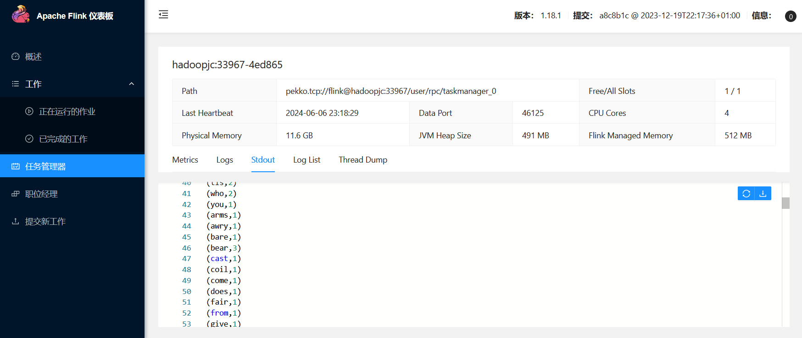

# FlinkWordCount
A Word Frequency Statistics Program Based on Flink基于Flink的词频统计程序

Flink的运行需要Java环境的支持，因此，在安装Flink之前，请先安装Java环境。（比如Java8）

把代码进行编译打包，打包成jar包，最后到Flink中运行Flinkwordcount.jar。这里一定要注意，要确认已经开启Flink系统

```shell
flink run --class jack.flink.FlinkWordCount FlinkWordCount-1.0-SNAPSHOT.jar
```




